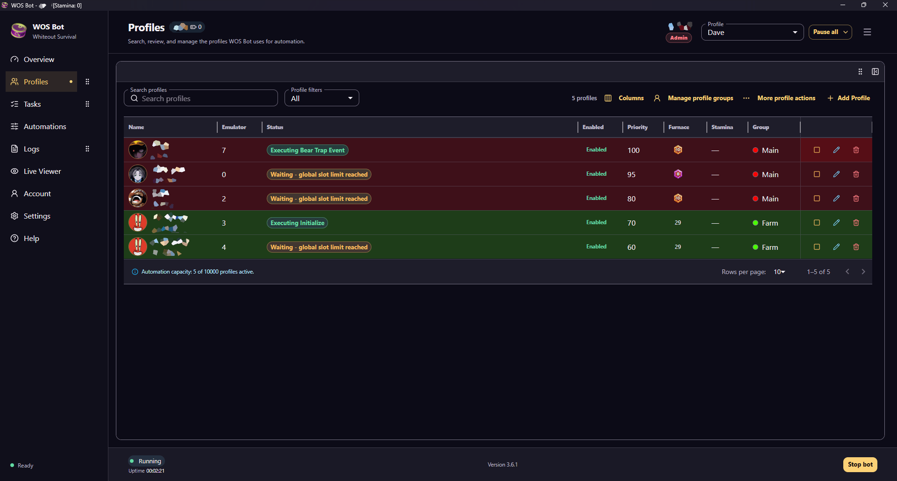

# Whiteout Survival Bot for Windows & Android — WOS Bot

**Automate your daily Whiteout Survival tasks: gathering, events, alliance, training and more. Free 7-day trial, no payment details needed.**

> **This repository is archived.** The actively developed WOS Bot is closed source and is only available from [camodev.me](https://camodev.me/whiteout-survival-bot?utm_source=github&utm_medium=readme&utm_content=archived_notice).

## What it does

WOS Bot is a Whiteout Survival auto farm bot that runs your routine tasks for you, on a schedule, across multiple accounts. **56 automated tasks**, including:

- **Alliance:** auto-join, chests, shop, tech, triumph chest
- **City:** building upgrades, training, research, mail and VIP rewards, hero recruitment, pets, experts, Tundra Trek
- **Events:** Bear Trap, Alliance Championship, Alliance Mobilization, Lucky Wheel, Tundra Truck and more
- **World map:** gathering, intel, beast hunting, Polar Terror hunting
- **Deals and shops:** Bank, Myriad Bazaar, Mystery Shop, Nomadic Merchant

Also included: multiple game accounts (profiles), scheduling, live logs, and a live viewer of your game.

## Get started in 4 steps

1. [Create a free account](https://camodev.me/download?utm_source=github&utm_medium=readme&utm_content=steps) and verify your email.
2. Download the **Windows installer** (Windows 10+) or the **Android APK** (Android 8.0+).
3. Windows only: set up MuMu Player at 720x1280, 320 DPI, 2 CPU cores and 2 GB RAM. The game language must be English.
4. Sign in and start your 7-day trial. Premium is unlocked, and nothing is charged when it ends.

## Plans

| | Free | Premium |
| --- | --- | --- |
| Price | $0 | $10 / month |
| Tasks | City upgrades, City events, Shop, Alliance, Training | All 56 tasks, including events and gathering |
| Profiles | 2 | 4 (extra profiles: $1/month per 2) |

Cancel anytime. [See full pricing](https://camodev.me/pricing?utm_source=github&utm_medium=readme&utm_content=plans)

## FAQ

**Is it free?** The basic tasks are free. New accounts also get a 7-day Premium trial with no payment details required.

**Do I need an emulator?** On Windows, yes: MuMu Player. The Android version runs directly on your device.

**Is it safe?** Any automation tool may go against the game's terms of service, so use it at your own risk. See the [full FAQ](https://camodev.me/faq?utm_source=github&utm_medium=readme&utm_content=faq).

**Is the old open-source version still available?** No. Development moved to a closed-source model. Only the official version is maintained, so don't download copies from third parties.

## Community & support

Updates, setup help and feature requests are on the [official Discord](https://discord.gg/muUqfCKNJn).

**[Download WOS Bot →](https://camodev.me/whiteout-survival-bot?utm_source=github&utm_medium=readme&utm_content=footer)**

---

*WOS Bot is an independent tool and is not affiliated with, endorsed by, or sponsored by the developers or publishers of Whiteout Survival. Automation may violate the game's terms of service. Use at your own risk.*
